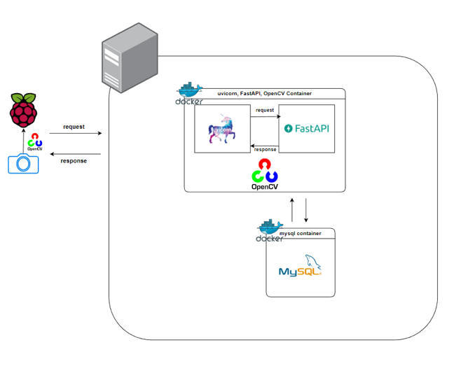
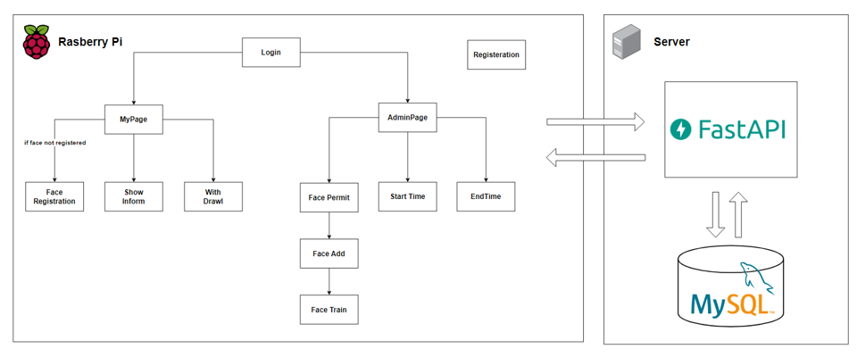

# 얼굴 인식 기반 출 퇴근 관리 시스템
얼굴 인식을 통한 출, 퇴근 관리 및 근무시간을 관리하기 위한 프로그램

## Used Technologies, SWs, Platforms
- Docker
- Uvicorn
- MySQL
- FastAPI
- Python(Tkinter, OpenCV)

## System Architecture
    

## Block Diagram
    

## Function
 - 회원가입 및 로그인 기능 구현
 - 관리자와 일반 유저로 분기
 - 일반 유저는 회원가입 및 얼굴 등록을 실시 후 관리자의 허용이 있어야 얼굴 등록이 완료됨
 - 관리자는 일반 유저의 얼굴 등록을 허용하거나 거절할 수 있음
 - 출근과 퇴근 시간이 기록 되고 사용자별 한달간의 총 근무시간을 확인 가능함 
